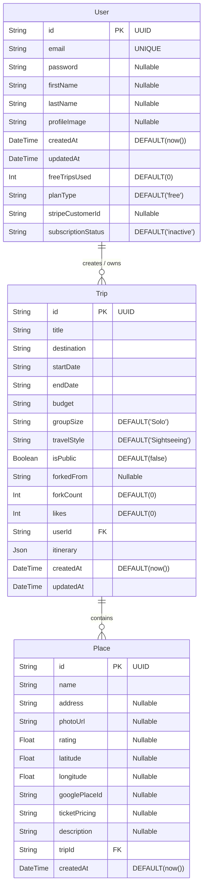

# ER Diagram — Atlas AI (Entity-Relationship)

## Database Schema (PostgreSQL / Prisma)

---

## Explanation of Entities and Relationships

### `User`
- Represents an authenticated user in the system.
- Has a **one-to-many** (`1:N`) relationship with `Trip`s. A user can create many trips, but each trip belongs to exactly one user.
- Contains fields for Stripe subscription management (`planType`, `stripeCustomerId`, `subscriptionStatus`) to track access control.

### `Trip`
- Represents a generated or forked travel itinerary.
- Belongs to a single `User` via the `userId` foreign key.
- Has a **one-to-many** (`1:N`) relationship with `Place`s. A trip consists of multiple places, and each place record belongs to a specific trip.
- Stores the core AI-generated schedule in the `itinerary` (JSON) field.
- Community features are supported by `isPublic` (boolean toggle), `forkedFrom` (self-referencing logic but at application level, pointing to another trip ID), and metric fields like `forkCount` and `likes`.

### `Place`
- Represents a specific point of interest (POI), hotel, or restaurant associated with a trip.
- Belongs to a single `Trip` via the `tripId` foreign key.
- Caches data heavily from the Google Places API (`googlePlaceId`, `latitude`, `longitude`, `rating`, `photoUrl`) to populate map markers and UI cards efficiently without re-querying the API unnecessarily.
