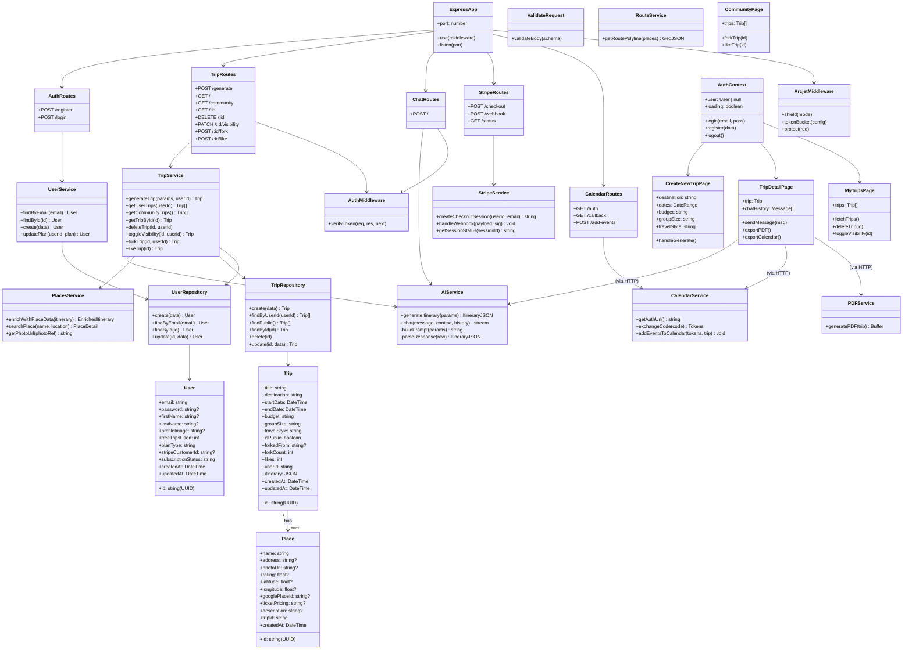
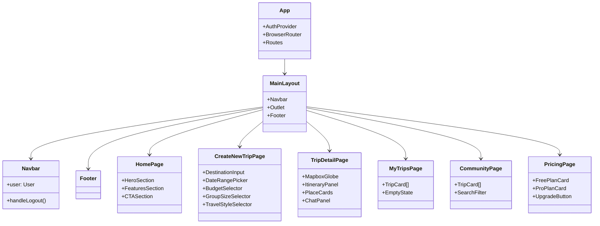

# Class Diagram — Atlas AI

## Backend Class Diagram

```mermaid
classDiagram
    direction TB

    %% ─── Entry Point ───
    class ExpressApp {
        +port: number
        +use(middleware)
        +listen(port)
    }

    %% ─── Middleware ───
    class AuthMiddleware {
        +verifyToken(req, res, next)
    }

    class ArcjetMiddleware {
        +shield(mode)
        +tokenBucket(config)
        +protect(req)
    }

    class ValidateRequest {
        +validateBody(schema)
    }

    %% ─── Routes ───
    class AuthRoutes {
        +POST /register
        +POST /login
    }

    class TripRoutes {
        +POST /generate
        +GET /
        +GET /community
        +GET /:id
        +DELETE /:id
        +PATCH /:id/visibility
        +POST /:id/fork
        +POST /:id/like
    }

    class ChatRoutes {
        +POST /
    }

    class StripeRoutes {
        +POST /checkout
        +POST /webhook
        +GET /status
    }

    class CalendarRoutes {
        +GET /auth
        +GET /callback
        +POST /add-events
    }

    %% ─── Services ───
    class UserService {
        +findByEmail(email) User
        +findById(id) User
        +create(data) User
        +updatePlan(userId, plan) User
    }

    class TripService {
        +generateTrip(params, userId) Trip
        +getUserTrips(userId) Trip[]
        +getCommunityTrips() Trip[]
        +getTripById(id) Trip
        +deleteTrip(id, userId)
        +toggleVisibility(id, userId) Trip
        +forkTrip(id, userId) Trip
        +likeTrip(id) Trip
    }

    class AIService {
        +generateItinerary(params) ItineraryJSON
        +chat(message, context, history) stream
        -buildPrompt(params) string
        -parseResponse(raw) ItineraryJSON
    }

    class PlacesService {
        +enrichWithPlaceData(itinerary) EnrichedItinerary
        +searchPlace(name, location) PlaceDetail
        +getPhotoUrl(photoRef) string
    }

    class StripeService {
        +createCheckoutSession(userId, email) string
        +handleWebhook(payload, sig) void
        +getSessionStatus(sessionId) string
    }

    class CalendarService {
        +getAuthUrl() string
        +exchangeCode(code) Tokens
        +addEventsToCalendar(tokens, trip) void
    }

    class PDFService {
        +generatePDF(trip) Buffer
    }

    class RouteService {
        +getRoutePolyline(places) GeoJSON
    }

    %% ─── Repositories ───
    class TripRepository {
        +create(data) Trip
        +findByUserId(userId) Trip[]
        +findPublic() Trip[]
        +findById(id) Trip
        +delete(id)
        +update(id, data) Trip
    }

    class UserRepository {
        +create(data) User
        +findByEmail(email) User
        +findById(id) User
        +update(id, data) User
    }

    %% ─── Domain Models ───
    class User {
        +id: string (UUID)
        +email: string
        +password: string?
        +firstName: string?
        +lastName: string?
        +profileImage: string?
        +freeTripsUsed: int
        +planType: string
        +stripeCustomerId: string?
        +subscriptionStatus: string
        +createdAt: DateTime
        +updatedAt: DateTime
    }

    class Trip {
        +id: string (UUID)
        +title: string
        +destination: string
        +startDate: DateTime
        +endDate: DateTime
        +budget: string
        +groupSize: string
        +travelStyle: string
        +isPublic: boolean
        +forkedFrom: string?
        +forkCount: int
        +likes: int
        +userId: string
        +itinerary: JSON
        +createdAt: DateTime
        +updatedAt: DateTime
    }

    class Place {
        +id: string (UUID)
        +name: string
        +address: string?
        +photoUrl: string?
        +rating: float?
        +latitude: float?
        +longitude: float?
        +googlePlaceId: string?
        +ticketPricing: string?
        +description: string?
        +tripId: string
        +createdAt: DateTime
    }

    %% ─── Frontend Components ───
    class AuthContext {
        +user: User | null
        +loading: boolean
        +login(email, pass)
        +register(data)
        +logout()
    }

    class CreateNewTripPage {
        +destination: string
        +dates: DateRange
        +budget: string
        +groupSize: string
        +travelStyle: string
        +handleGenerate()
    }

    class TripDetailPage {
        +trip: Trip
        +chatHistory: Message[]
        +sendMessage(msg)
        +exportPDF()
        +exportCalendar()
    }

    class MyTripsPage {
        +trips: Trip[]
        +fetchTrips()
        +deleteTrip(id)
        +toggleVisibility(id)
    }

    class CommunityPage {
        +trips: Trip[]
        +forkTrip(id)
        +likeTrip(id)
    }

    %% ─── Relationships ───
    ExpressApp --> AuthRoutes
    ExpressApp --> TripRoutes
    ExpressApp --> ChatRoutes
    ExpressApp --> StripeRoutes
    ExpressApp --> CalendarRoutes
    ExpressApp --> ArcjetMiddleware

    AuthRoutes --> UserService
    TripRoutes --> TripService
    TripRoutes --> AuthMiddleware
    ChatRoutes --> AIService
    ChatRoutes --> AuthMiddleware
    StripeRoutes --> StripeService
    CalendarRoutes --> CalendarService

    TripService --> AIService
    TripService --> PlacesService
    TripService --> TripRepository
    TripService --> UserRepository

    UserService --> UserRepository

    TripRepository --> Trip
    UserRepository --> User
    Trip "1" --> "many" Place : has

    AuthContext --> CreateNewTripPage
    AuthContext --> TripDetailPage
    AuthContext --> MyTripsPage
    TripDetailPage --> AIService : (via HTTP)
    TripDetailPage --> CalendarService : (via HTTP)
    TripDetailPage --> PDFService : (via HTTP)
```

---

## Frontend Component Hierarchy

```mermaid
classDiagram
    direction TB

    class App {
        +AuthProvider
        +BrowserRouter
        +Routes
    }

    class MainLayout {
        +Navbar
        +Outlet
        +Footer
    }

    class Navbar {
        +user: User
        +handleLogout()
    }

    class Footer

    class HomePage {
        +HeroSection
        +FeaturesSection
        +CTASection
    }

    class CreateNewTripPage {
        +DestinationInput
        +DateRangePicker
        +BudgetSelector
        +GroupSizeSelector
        +TravelStyleSelector
    }

    class TripDetailPage {
        +MapboxGlobe
        +ItineraryPanel
        +PlaceCards
        +ChatPanel
    }

    class MyTripsPage {
        +TripCard[]
        +EmptyState
    }

    class CommunityPage {
        +TripCard[]
        +SearchFilter
    }

    class PricingPage {
        +FreePlanCard
        +ProPlanCard
        +UpgradeButton
    }

    App --> MainLayout
    MainLayout --> Navbar
    MainLayout --> Footer
    MainLayout --> HomePage
    MainLayout --> CreateNewTripPage
    MainLayout --> TripDetailPage
    MainLayout --> MyTripsPage
    MainLayout --> CommunityPage
    MainLayout --> PricingPage
```
