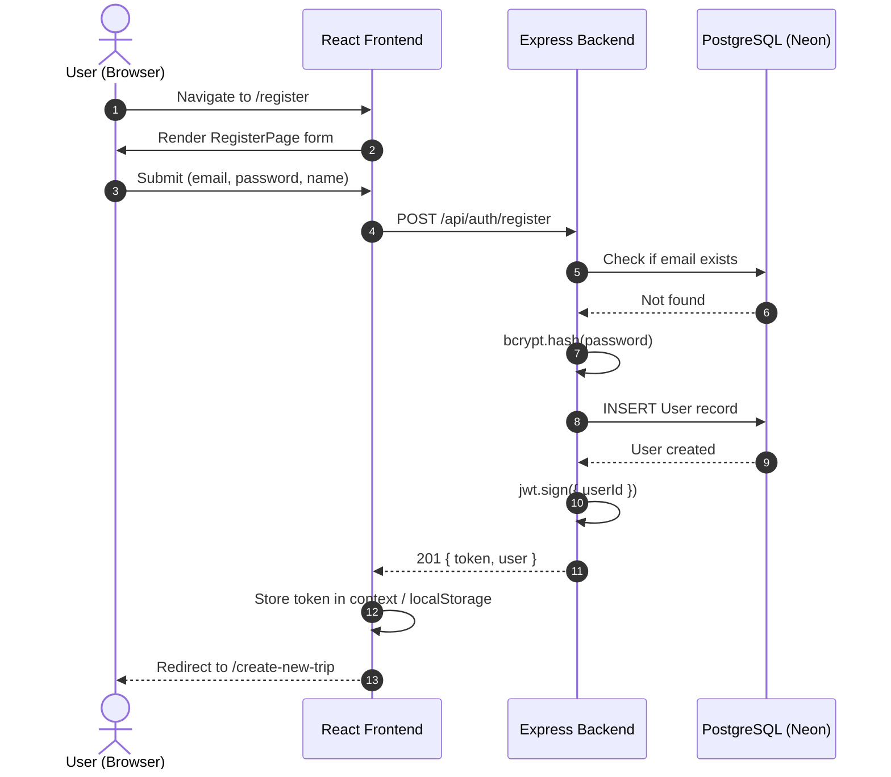
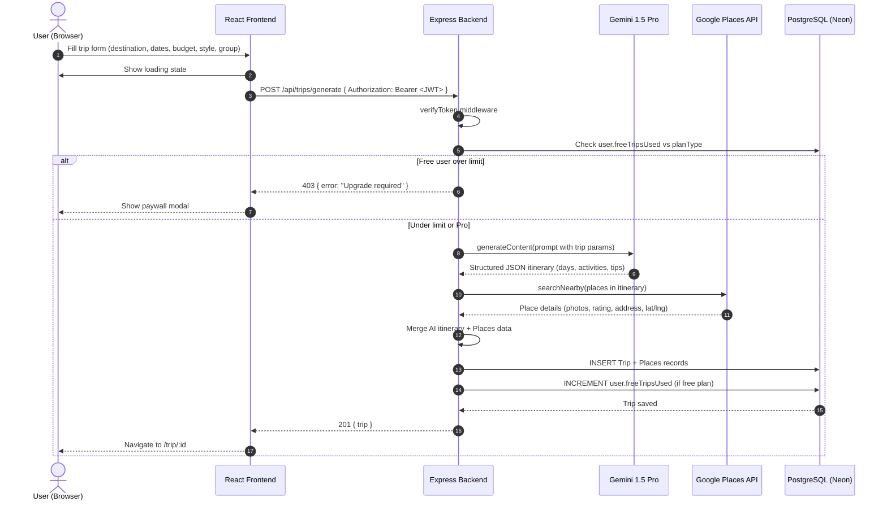
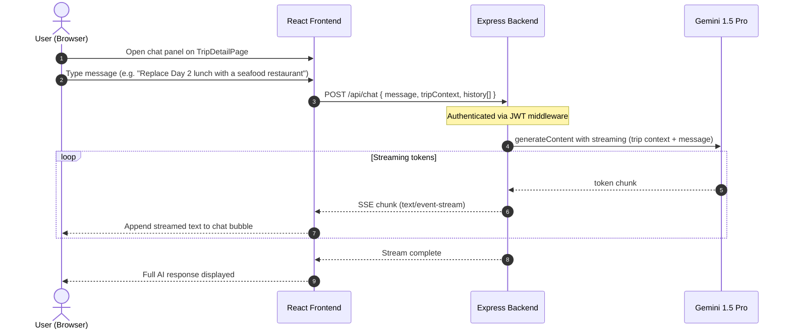
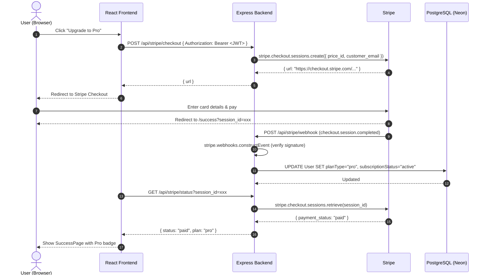
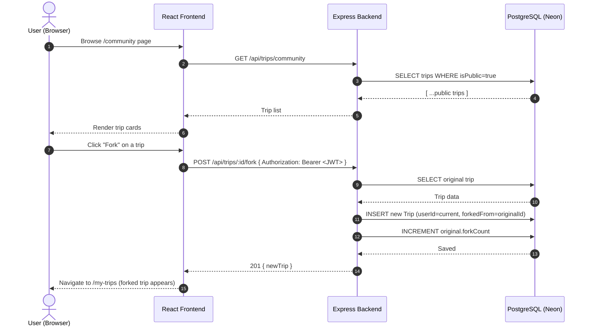

# Sequence Diagram — Atlas AI (Main Flow End-to-End)

## Flow 1: User Registration & Login

---

## Flow 2: AI Trip Generation (Key Flow)

---

## Flow 3: Chat with AI to Refine Trip

---

## Flow 4: Stripe Subscription Upgrade

---

## Flow 5: Community Trip Fork

