# Use Case Diagram — Atlas AI

## Diagram

```mermaid
graph TD
    Guest([👤 Guest])
    FreeUser([👤 Free User])
    ProUser([👤 Pro User])
    Stripe([💳 Stripe])
    Gemini([🤖 Gemini AI])
    GooglePlaces([📍 Google Places API])
    GoogleCalendar([📅 Google Calendar])

    Guest --> UC1[Browse Landing Page]
    Guest --> UC2[View Community Trips]
    Guest --> UC3[Register / Sign Up]
    Guest --> UC4[Login]

    FreeUser --> UC4
    FreeUser --> UC5[Generate AI Trip - up to 3]
    FreeUser --> UC6[View Trip Detail & Map]
    FreeUser --> UC7[Chat with AI to Refine Trip]
    FreeUser --> UC8[View My Trips]
    FreeUser --> UC9[Make Trip Public]
    FreeUser --> UC10[Fork Community Trip]
    FreeUser --> UC11[Subscribe to Pro Plan]
    FreeUser --> UC2

    ProUser --> UC5b[Generate AI Trip - Unlimited]
    ProUser --> UC6
    ProUser --> UC7
    ProUser --> UC8
    ProUser --> UC9
    ProUser --> UC10
    ProUser --> UC12[Export Trip to PDF]
    ProUser --> UC13[Export Trip to Google Calendar]
    ProUser --> UC2

    UC5 --> Gemini
    UC5b --> Gemini
    UC5 --> GooglePlaces
    UC5b --> GooglePlaces
    UC7 --> Gemini
    UC11 --> Stripe
    UC13 --> GoogleCalendar
```

---

## Use Case Descriptions

### UC1 — Browse Landing Page
- **Actor**: Guest
- **Description**: View the hero section, features overview, and sample trip cards without authentication.

### UC2 — View Community Trips
- **Actor**: Guest, Free User, Pro User
- **Description**: Browse publicly shared itineraries from other users; view trip detail, map, and places.

### UC3 — Register / Sign Up
- **Actor**: Guest
- **Description**: Create a new account with email + password. Starts on the free plan with 3 trip credits.

### UC4 — Login
- **Actor**: Guest (becoming Free/Pro User)
- **Description**: Authenticate with email + password. JWT issued and stored client-side.

### UC5 — Generate AI Trip (Free — up to 3)
- **Actor**: Free User
- **Description**: Fill in destination, dates, budget, group size, and travel style. The AI generates a day-by-day itinerary with real venue data from Google Places.
- **Constraints**: Blocked after 3 trips unless upgraded.

### UC5b — Generate AI Trip (Unlimited)
- **Actor**: Pro User
- **Description**: Same as UC5 but with no generation limit.

### UC6 — View Trip Detail & Map
- **Actor**: Free User, Pro User
- **Description**: See the full itinerary by day, venue cards with photos and ratings, and a 3D Mapbox globe with place pins.

### UC7 — Chat with AI to Refine Trip
- **Actor**: Free User, Pro User
- **Description**: Open a conversational chat panel on the trip detail page to ask the AI to swap activities, add restaurants, adjust timing, etc.

### UC8 — View My Trips
- **Actor**: Free User, Pro User
- **Description**: Dashboard listing all created trips with status, destination thumbnail, and quick actions.

### UC9 — Make Trip Public
- **Actor**: Free User, Pro User
- **Description**: Toggle trip visibility so it appears in the Community Hub and can be forked by others.

### UC10 — Fork Community Trip
- **Actor**: Free User, Pro User
- **Description**: Clone another user's public itinerary into your own account for editing.

### UC11 — Subscribe to Pro Plan
- **Actor**: Free User
- **Description**: Click "Upgrade" to be redirected to Stripe Checkout. On success, subscription status is updated via Stripe Webhook and user gets unlimited access.

### UC12 — Export Trip to PDF
- **Actor**: Pro User
- **Description**: Download a formatted, print-ready PDF of the full itinerary.

### UC13 — Export Trip to Google Calendar
- **Actor**: Pro User
- **Description**: Authorise Google Calendar via OAuth2 and have each day's activities added as calendar events.
